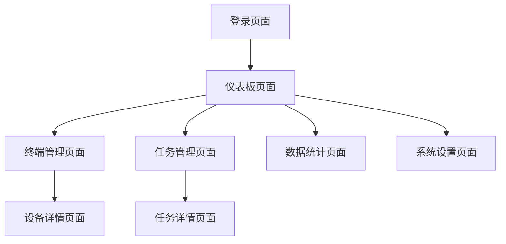

# 游戏脚本中间件管理系统 - 产品需求文档

## 1. 产品概述

游戏脚本中间件管理系统是一个基于Web的终端设备管理平台，通过HTTP API实现终端设备的统一管理、监控和控制。
- 解决游戏脚本终端设备分散管理的问题，为运营人员和开发者提供集中化的设备管理界面。
- 目标是提升设备管理效率，降低运维成本，实现设备状态的实时监控和数据统计分析。

## 2. 核心功能

### 2.1 用户角色

| 角色 | 注册方式 | 核心权限 |
|------|----------|----------|
| 管理员 | 系统预设账户 | 系统配置、用户管理、全部设备管理 |
| 运营人员 | 管理员邀请注册 | 设备监控、任务下发、数据查看 |
| 开发者 | API密钥申请 | 设备接入、数据上报、状态查询 |

### 2.2 功能模块

我们的游戏脚本中间件管理系统包含以下主要页面：

1. **登录页面**：用户身份验证、权限验证
2. **仪表板页面**：系统概览、设备统计、实时状态监控
3. **终端管理页面**：设备列表、设备详情、设备操作
4. **任务管理页面**：任务创建、任务分发、执行状态跟踪
5. **数据统计页面**：设备数据分析、性能报表、趋势图表
6. **系统设置页面**：用户管理、权限配置、系统参数

### 2.3 页面详情

| 页面名称 | 模块名称 | 功能描述 |
|----------|----------|----------|
| 登录页面 | 用户认证 | 用户名密码登录、权限验证、会话管理 |
| 仪表板页面 | 概览统计 | 显示在线设备数量、任务执行状态、系统健康度 |
| 仪表板页面 | 实时监控 | 设备状态实时更新、告警信息展示 |
| 终端管理页面 | 设备列表 | 分页显示所有终端设备、搜索过滤、批量操作 |
| 终端管理页面 | 设备详情 | 查看设备详细信息、历史记录、性能数据 |
| 终端管理页面 | 设备操作 | 通过HTTP API下发指令到终端、重启设备、更新配置 |
| 任务管理页面 | 任务创建 | 创建新任务、设置执行参数、选择目标设备 |
| 任务管理页面 | 任务分发 | 将任务通过HTTP API分发到指定终端 |
| 任务管理页面 | 状态跟踪 | 实时查看任务执行进度、结果反馈 |
| 数据统计页面 | 数据分析 | 设备性能数据统计、使用率分析 |
| 数据统计页面 | 报表生成 | 生成各类统计报表、数据导出 |
| 系统设置页面 | 用户管理 | 添加删除用户、角色权限分配 |
| 系统设置页面 | 系统配置 | API接口配置、数据输出设置 |

## 3. 核心流程

### 管理员流程
1. 管理员登录系统
2. 查看系统仪表板，了解整体运行状态
3. 管理用户账户和权限
4. 配置系统参数和API接口
5. 监控系统运行状态

### 运营人员流程
1. 运营人员登录系统
2. 查看仪表板了解设备状态
3. 在终端管理页面查看和操作设备
4. 创建和分发任务到指定设备
5. 查看数据统计和生成报表

### 开发者API流程
1. 获取API密钥进行身份验证
2. 终端设备通过HTTP API注册到系统
3. 设备定期上报状态和数据
4. 接收系统下发的任务指令
5. 上报任务执行结果

## 4. 用户界面设计

### 4.1 设计风格

- **主色调**：深蓝色(#1890ff)作为主色，浅灰色(#f5f5f5)作为背景色
- **按钮样式**：圆角矩形按钮，主要按钮使用渐变效果
- **字体**：中文使用微软雅黑，英文使用Roboto，主要字号14px，标题18px
- **布局风格**：卡片式布局，左侧导航栏，顶部面包屑导航
- **图标风格**：使用Ant Design图标库，简洁现代风格

### 4.2 页面设计概览

| 页面名称 | 模块名称 | UI元素 |
|----------|----------|--------|
| 登录页面 | 登录表单 | 居中卡片布局，白色背景，蓝色登录按钮，输入框圆角设计 |
| 仪表板页面 | 统计卡片 | 4列网格布局，白色卡片，彩色数字显示，图标装饰 |
| 仪表板页面 | 图表区域 | 响应式图表，使用ECharts，蓝色主题配色 |
| 终端管理页面 | 设备表格 | Ant Design Table组件，分页器，搜索框，操作按钮 |
| 终端管理页面 | 操作按钮 | 蓝色主按钮，灰色次要按钮，危险操作红色按钮 |
| 任务管理页面 | 任务列表 | 卡片式列表，状态标签，进度条显示 |
| 数据统计页面 | 图表展示 | 多种图表类型，统一配色方案，响应式布局 |
| 系统设置页面 | 表单组件 | 标准表单布局，输入验证，保存按钮 |

### 4.3 响应式设计

系统采用桌面优先的响应式设计，支持平板和移动设备访问，针对触摸操作进行了优化，按钮和链接区域适当增大以便触摸操作。