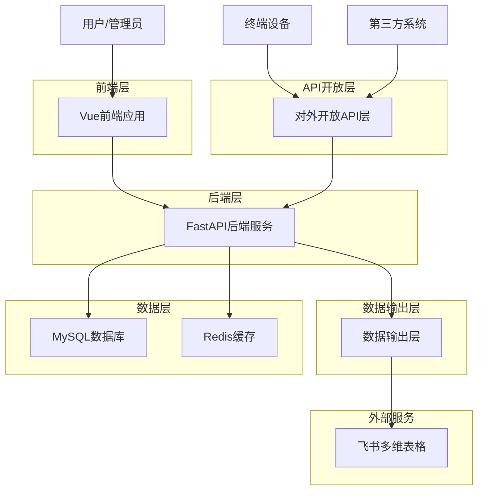
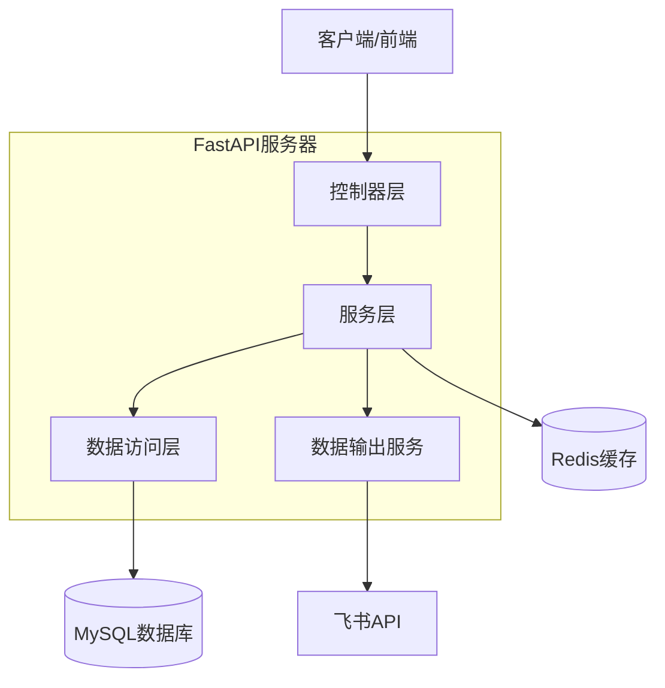
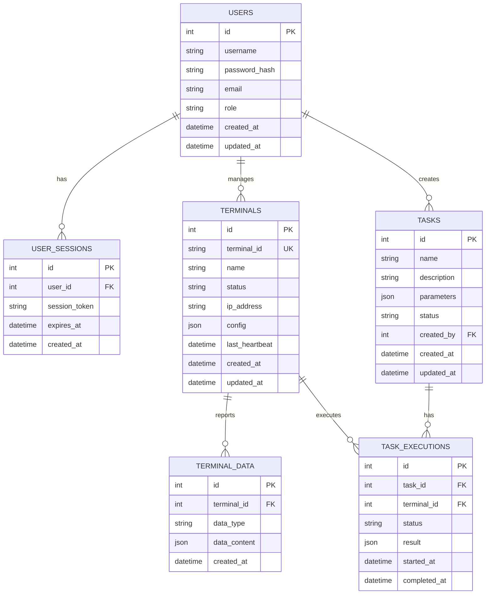

# 游戏脚本中间件管理系统 - 核心技术架构文档

## 1. 架构设计



## 2. 技术描述

- 前端：Vue@3 + Element Plus + Vite + TypeScript
- 后端：Python FastAPI + SQLAlchemy + Pydantic
- 数据库：MySQL@8.0 + Redis@7.0
- 数据输出：飞书多维表格API集成

## 3. 路由定义

| 路由 | 用途 |
|------|------|
| /login | 登录页面，用户身份验证 |
| /dashboard | 仪表板页面，系统概览和实时监控 |
| /terminals | 终端管理页面，设备列表和操作 |
| /terminals/:id | 终端详情页面，单个设备详细信息 |
| /tasks | 任务管理页面，任务创建和监控 |
| /tasks/:id | 任务详情页面，任务执行状态 |
| /statistics | 数据统计页面，报表和分析 |
| /settings | 系统设置页面，配置和用户管理 |

## 4. API定义

### 4.1 核心API

#### 用户认证相关
```
POST /api/auth/login
```

请求：
| 参数名 | 参数类型 | 是否必需 | 描述 |
|--------|----------|----------|------|
| username | string | true | 用户名 |
| password | string | true | 密码 |

响应：
| 参数名 | 参数类型 | 描述 |
|--------|----------|------|
| access_token | string | JWT访问令牌 |
| token_type | string | 令牌类型 |
| expires_in | integer | 过期时间(秒) |

示例：
```json
{
  "username": "admin",
  "password": "123456"
}
```

#### 终端设备管理
```
GET /api/terminals
POST /api/terminals
GET /api/terminals/{terminal_id}
PUT /api/terminals/{terminal_id}
DELETE /api/terminals/{terminal_id}
```

#### 任务管理
```
GET /api/tasks
POST /api/tasks
GET /api/tasks/{task_id}
PUT /api/tasks/{task_id}
DELETE /api/tasks/{task_id}
POST /api/tasks/{task_id}/execute
```

#### 数据统计
```
GET /api/statistics/overview
GET /api/statistics/terminals
GET /api/statistics/tasks
GET /api/statistics/export
```

#### 系统配置
```
GET /api/settings
PUT /api/settings
GET /api/users
POST /api/users
PUT /api/users/{user_id}
DELETE /api/users/{user_id}
```

### 4.2 对外开放API

#### 终端注册和数据上报
```
POST /open-api/terminals/register
POST /open-api/terminals/{terminal_id}/heartbeat
POST /open-api/terminals/{terminal_id}/data
GET /open-api/terminals/{terminal_id}/tasks
POST /open-api/terminals/{terminal_id}/task-result
```

## 5. 服务器架构图



## 6. 数据模型

### 6.1 数据模型定义



### 6.2 数据定义语言

#### 用户表 (users)
```sql
CREATE TABLE users (
    id INT AUTO_INCREMENT PRIMARY KEY,
    username VARCHAR(50) UNIQUE NOT NULL,
    password_hash VARCHAR(255) NOT NULL,
    email VARCHAR(100) UNIQUE NOT NULL,
    role ENUM('admin', 'operator', 'developer') DEFAULT 'operator',
    created_at TIMESTAMP DEFAULT CURRENT_TIMESTAMP,
    updated_at TIMESTAMP DEFAULT CURRENT_TIMESTAMP ON UPDATE CURRENT_TIMESTAMP
);

CREATE INDEX idx_users_username ON users(username);
CREATE INDEX idx_users_email ON users(email);
```

#### 用户会话表 (user_sessions)
```sql
CREATE TABLE user_sessions (
    id INT AUTO_INCREMENT PRIMARY KEY,
    user_id INT NOT NULL,
    session_token VARCHAR(255) UNIQUE NOT NULL,
    expires_at TIMESTAMP NOT NULL,
    created_at TIMESTAMP DEFAULT CURRENT_TIMESTAMP,
    FOREIGN KEY (user_id) REFERENCES users(id) ON DELETE CASCADE
);

CREATE INDEX idx_sessions_token ON user_sessions(session_token);
CREATE INDEX idx_sessions_user_id ON user_sessions(user_id);
```

#### 终端设备表 (terminals)
```sql
CREATE TABLE terminals (
    id INT AUTO_INCREMENT PRIMARY KEY,
    terminal_id VARCHAR(100) UNIQUE NOT NULL,
    name VARCHAR(100) NOT NULL,
    status ENUM('online', 'offline', 'error') DEFAULT 'offline',
    ip_address VARCHAR(45),
    config JSON,
    last_heartbeat TIMESTAMP,
    created_at TIMESTAMP DEFAULT CURRENT_TIMESTAMP,
    updated_at TIMESTAMP DEFAULT CURRENT_TIMESTAMP ON UPDATE CURRENT_TIMESTAMP
);

CREATE INDEX idx_terminals_terminal_id ON terminals(terminal_id);
CREATE INDEX idx_terminals_status ON terminals(status);
CREATE INDEX idx_terminals_last_heartbeat ON terminals(last_heartbeat);
```

#### 终端数据表 (terminal_data)
```sql
CREATE TABLE terminal_data (
    id INT AUTO_INCREMENT PRIMARY KEY,
    terminal_id INT NOT NULL,
    data_type VARCHAR(50) NOT NULL,
    data_content JSON NOT NULL,
    created_at TIMESTAMP DEFAULT CURRENT_TIMESTAMP,
    FOREIGN KEY (terminal_id) REFERENCES terminals(id) ON DELETE CASCADE
);

CREATE INDEX idx_terminal_data_terminal_id ON terminal_data(terminal_id);
CREATE INDEX idx_terminal_data_type ON terminal_data(data_type);
CREATE INDEX idx_terminal_data_created_at ON terminal_data(created_at);
```

#### 任务表 (tasks)
```sql
CREATE TABLE tasks (
    id INT AUTO_INCREMENT PRIMARY KEY,
    name VARCHAR(100) NOT NULL,
    description TEXT,
    parameters JSON,
    status ENUM('pending', 'running', 'completed', 'failed') DEFAULT 'pending',
    created_by INT NOT NULL,
    created_at TIMESTAMP DEFAULT CURRENT_TIMESTAMP,
    updated_at TIMESTAMP DEFAULT CURRENT_TIMESTAMP ON UPDATE CURRENT_TIMESTAMP,
    FOREIGN KEY (created_by) REFERENCES users(id)
);

CREATE INDEX idx_tasks_status ON tasks(status);
CREATE INDEX idx_tasks_created_by ON tasks(created_by);
CREATE INDEX idx_tasks_created_at ON tasks(created_at);
```

#### 任务执行表 (task_executions)
```sql
CREATE TABLE task_executions (
    id INT AUTO_INCREMENT PRIMARY KEY,
    task_id INT NOT NULL,
    terminal_id INT NOT NULL,
    status ENUM('pending', 'running', 'completed', 'failed') DEFAULT 'pending',
    result JSON,
    started_at TIMESTAMP,
    completed_at TIMESTAMP,
    FOREIGN KEY (task_id) REFERENCES tasks(id) ON DELETE CASCADE,
    FOREIGN KEY (terminal_id) REFERENCES terminals(id) ON DELETE CASCADE
);

CREATE INDEX idx_task_executions_task_id ON task_executions(task_id);
CREATE INDEX idx_task_executions_terminal_id ON task_executions(terminal_id);
CREATE INDEX idx_task_executions_status ON task_executions(status);
```

#### 初始数据
```sql
-- 创建默认管理员用户
INSERT INTO users (username, password_hash, email, role) VALUES 
('admin', '$2b$12$LQv3c1yqBWVHxkd0LHAkCOYz6TtxMQJqhN8/LewdBPj6hsxq5S/kS', 'admin@example.com', 'admin');

-- 创建示例终端设备
INSERT INTO terminals (terminal_id, name, status, ip_address) VALUES 
('TERM001', '测试终端1', 'offline', '192.168.1.100'),
('TERM002', '测试终端2', 'offline', '192.168.1.101');
```

## 7. 安全设计

### 7.1 身份认证
- 使用JWT令牌进行用户身份验证
- 令牌包含用户ID、角色和过期时间
- 支持令牌刷新机制

### 7.2 权限控制
- 基于角色的访问控制(RBAC)
- API接口级别的权限验证
- 数据级别的访问控制

### 7.3 数据安全
- 密码使用bcrypt加密存储
- 敏感数据传输使用HTTPS
- 数据库连接使用SSL加密

## 8. 性能优化

### 8.1 缓存策略
- Redis缓存用户会话信息
- 缓存频繁查询的统计数据
- 缓存终端状态信息

### 8.2 数据库优化
- 合理设计索引提升查询性能
- 使用连接池管理数据库连接
- 定期清理历史数据

### 8.3 API优化
- 实现分页查询减少数据传输
- 使用异步处理提升并发性能
- 实现请求限流防止滥用

## 9. 部署运维

### 9.1 容器化部署
- 使用Docker容器化部署
- 支持Docker Compose一键部署
- 支持Kubernetes集群部署

### 9.2 监控告警
- 集成Prometheus监控指标
- 配置Grafana可视化面板
- 设置关键指标告警

### 9.3 日志管理
- 结构化日志输出
- 日志分级管理
- 支持日志聚合和分析